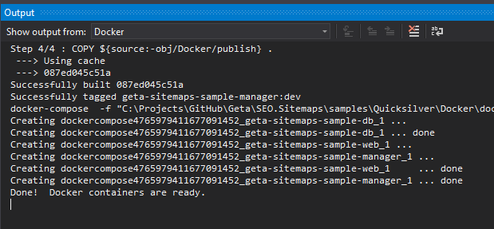

# SEO.Sitemaps

/statusIcon>)
[](https://msdn.microsoft.com/en-us/library/w0x726c2%28v=vs.110%29.aspx)
[](http://world.episerver.com/cms/)

Search engine sitemaps.xml for EPiServer CMS 11 and Commerce 13

## Description

This tool allows you to generate xml sitemaps for search engines to better index your EPiServer sites. Although there are several EPiServer sitemap tools available like [SearchEngineSitemaps](https://www.coderesort.com/p/epicode/wiki/SearchEngineSitemaps) and [EPiSiteMap](http://episitemap.codeplex.com/) which have inspired this project this tool gives you some additional specific features.

## Features

- sitemap generation as a scheduled job
- filtering pages by virtual directories
- ability to include pages that are in a different branch than the one of the start page
- ability to generate sitemaps for mobile pages
- it also supports multi-site and multi-language environments

## Latest release

The latest version is available on the EPiServer NuGet feed. You can find it by searching the term Geta.SEO.Sitemaps.

## Download

From nuget.episerver.com feed.

## Installation

1. Install Sitemap plugin via NuGet in Visual Studio. Ensure that you also install the required dependencies.
2. Rebuild your solution.
3. Configure sitemap settings and schedule the sitemap generation process. Configuration available at CMS -> Admin Mode -> Search engine sitemap settings.

## Configuration

Add a new sitemap definition and fill values for sitemap host and other fields:

- Path to include - only pages that have external url in the specified virtual path will be included in the sitemap
- Path to avoid - pages that have external url in the specified virtual path will not be included in the sitemap. If _Path to include_ specified this will be ignored.
- Root page id - the specified page and it's descendants will be listed in the sitemap. You can leave 0 to list all pages.
- Debug info - if checked sitemap will contain info about page id, language and name as a comment for each entry
- Format - currently standard or mobile (to specify [mobile content](http://support.google.com/webmasters/bin/answer.py?hl=en&answer=34648))


In case of multiple sites you choose for which site to host this sitemap:  


Each sitemap configuration must have a unique host name:


When configuration done go to the scheduled task "Generate search engine sitemaps" and run/schedule it to run in the necessary frequency. After the scheduled job has been run successfully you can view the sitemap(-s) by either opening the configured sitemap host or clicking "View" next to the sitemap configuration.

#### Enabling multi language support

Add this to your web.config file:

```xml
<configuration>
<configSections>
<section name="Geta.SEO.Sitemaps" type="Geta.SEO.Sitemaps.Configuration.SitemapConfigurationSection, Geta.SEO.Sitemaps"/>
</configSections>

  <Geta.SEO.Sitemaps>
    <settings enableLanguageDropDownInAdmin="true" />
  </Geta.SEO.Sitemaps>
</configuration>
```

### Dynamic property for specific pages

You can specify page specific sitemap properties (like change frequency, priority or inclulde/disinclude the specific page in any sitemap) for each EPiServer page by defining a dynamic property with type SEOSitemaps (and the same name):


and specify values for the dynamic property:


### Adding Sitemap Properties to all content pages

Credits to [jarihaa](https://github.com/jarihaa) for [contributing](https://github.com/Geta/SEO.Sitemaps/pull/87) this.

```
[UIHint("SeoSitemap")]
[BackingType(typeof(PropertySEOSitemaps))]
public virtual string SEOSitemaps { get; set; }
```

## Limitations

- Each sitemap will contain max 50k entries (according to [sitemaps.org protocol](http://www.sitemaps.org/protocol.html#index)) so if the site in which you are using this plugin contains more active pages then you should split them over multiple sitemaps (by specifying a different root page or include/avoid paths for each).

## Local development setup

In order to debug or contribute to the package, the QuickSilver demo site which is included in the repository can be used.

### Prerequisites

- Checkout the repository
- Install Docker on your local machine: https://docs.docker.com/get-started/
- Install the Docker extension for Visual Studio

### Get started

Set the `docker-compose` as default project (if not already by default). Now, the required images are downloaded (windows server and sql server), this will take some time. Note, this only happens the first time after that it cached on your local machine. See Output window (source Docker) to follow the progress. After you see the line 'Docker containers are ready', you are ready to run the project.



After the images are downloaded just run the project and start debugging the code. The frontend and backend code can be found in the Geta.SEO.Sitemaps and Geta.SEO.Sitemaps.Commerce project. The frontend code is available under the module folder.

### QuickSIlver login

Use the default admin@example.com user for QuickSilver, see [Installation](https://github.com/episerver/Quicksilver).

## Contributing

See [CONTRIBUTING.md](./CONTRIBUTING.md)

## Package maintainer

https://github.com/frederikvig

## Changelog

[Changelog](CHANGELOG.md)
