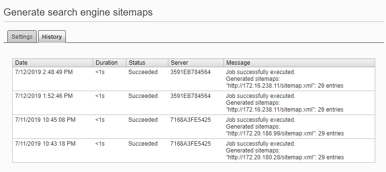

# Editor guide

## Configuration

Add a new sitemap definition and fill values for sitemap host and other fields:

- Path to include - only pages that have external url in the specified virtual path will be included in the sitemap
- Path to avoid - pages that have external url in the specified virtual path will not be included in the sitemap. If _Path to include_ specified this will be ignored.
- Root page id - the specified page and it's descendants will be listed in the sitemap. You can leave 0 to list all pages.
- Debug info - if checked sitemap will contain info about page id, language and name as a comment for each entry
- Format - currently standard or mobile (to specify [mobile content](http://support.google.com/webmasters/bin/answer.py?hl=en&answer=34648))
- Check 'Enable simple address support' to use the simple address (if used on the page) in the sitemap

In case of multiple sites you choose for which site to host this sitemap:  

Each sitemap configuration must have a unique host name:

## Scheduled job

When configuration done go to the scheduled task "Generate search engine sitemaps" and run/schedule it to run in the necessary frequency. After the scheduled job has been run successfully you can view the sitemap(-s) by either opening the configured sitemap host or clicking "View" next to the sitemap configuration.

## Sitemap property

Per page (needs to be defined on page type) the editor can control if the page should be included in the sitemap, the frequency and priority.

